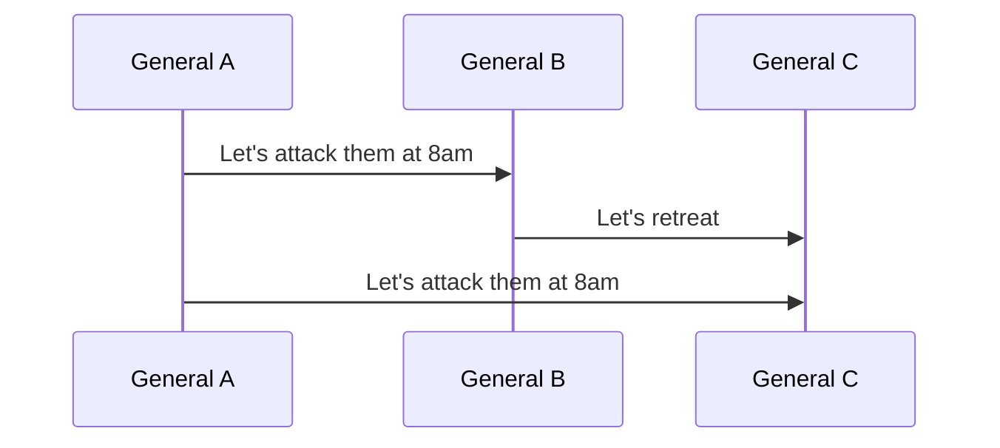
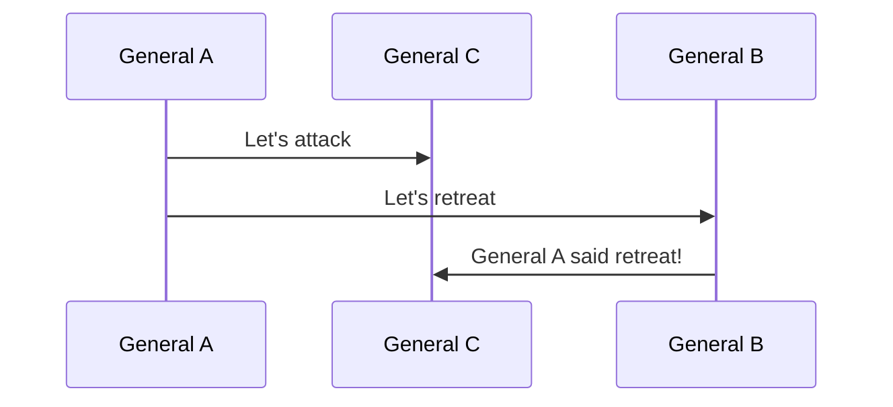
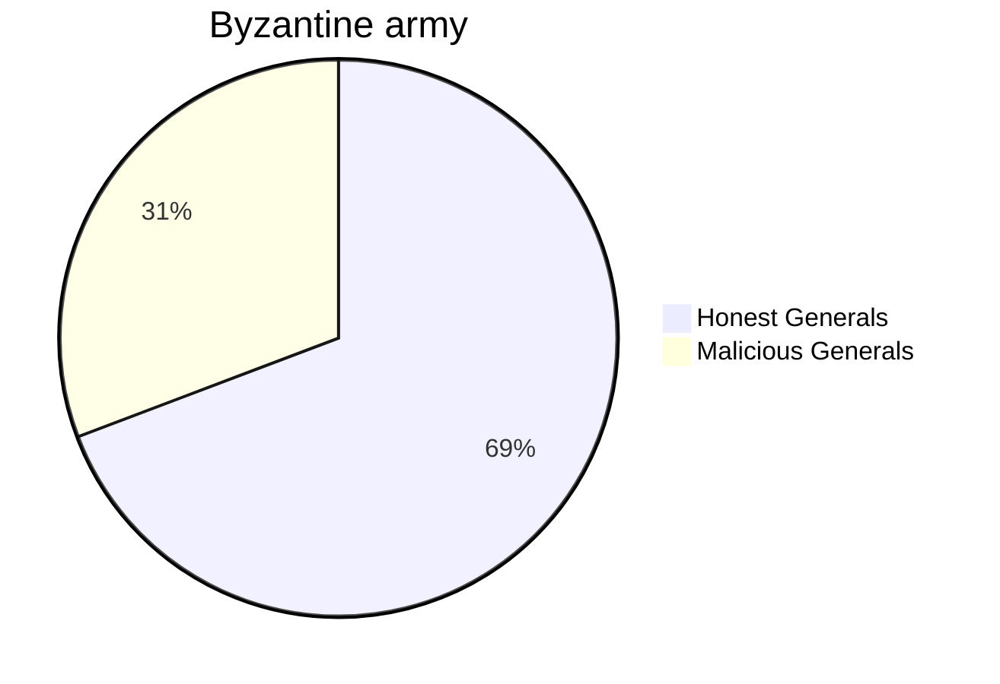

![[src/img/Pasted image 20231108200832.png]]
The Byzantine Generals Problem is an allegorical representation of the challenges in achieving consensus within a distributed system with potentially unreliable components.

## The problem
The scenario is similar to the [[two generals problem]] but this one involves multiple armies, each led by a general, who must coordinate an attack on a city. They communicate through messengers. Unlike the [[two generals problem]], it is assumed that communication is reliable, however, the complexity arises with the potential presence of traitorous generals.

## Example of Treachery
A treacherous general might send conflicting information to different generals, thus causing confusion that could lead to the failure of the attack's coordination. For instance, General A sends an attack order to two other generals, but one of the receivers, being traitorous, communicates the opposite instruction.

For example, if **General A** sends an attack message to **B** and **C**, from the point of **General C**, if **B** call a fallback while **A** call an attack, **A** and **B** know the truth but **C** is confused.

In another scenario **General A** wanted to attack but he received an interesting information and then decided to change the strategy. **General C** thinks they are going to attack because it was the first call of the **General A** but **A** changed his plan and told it to the **General B** now **B** transmitted the message to **C** but **C** is confused, is it a fake call to make the attack of the army fails ?
In this example everyone is honest, but it's still confused for **C**.

## Solution and Constraints
To resolve this problem, a consensus must be reached among the loyal generals. It has been established that for $f$ malicious generals, we need at least $3f+1$ in total to tolerate $f$, so $<\frac{1}{3}$ can be malicious for a solution to be viable.
To sum up, if we have 4 malicious generals, we need $4*3+1=13$ generals in total.

**Practical Relevance** 
In real-world scenarios, similar issues arise, such as in online transactions where all parties must reach a consensus on the status of an order. The shop may distrusts the customer out of concern that they could try to order items without paying for them. From the perspective of the payment service, the shop could be fraudulent, for instance someone might setup a fake shop and use stolen credit card numbers to process numerous transactions, thereby obtaining money without providing any services or goods to the customer, and so on..

**Links:**
- [[distributed system]]
- [[two generals problem]]