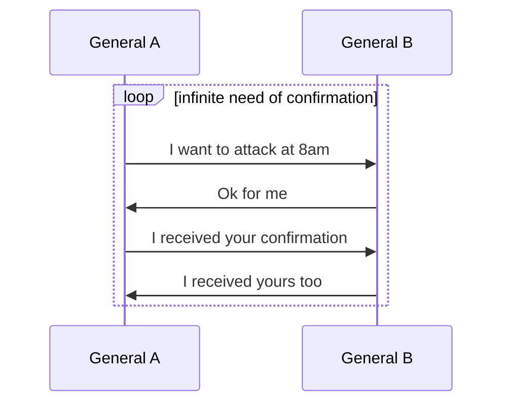
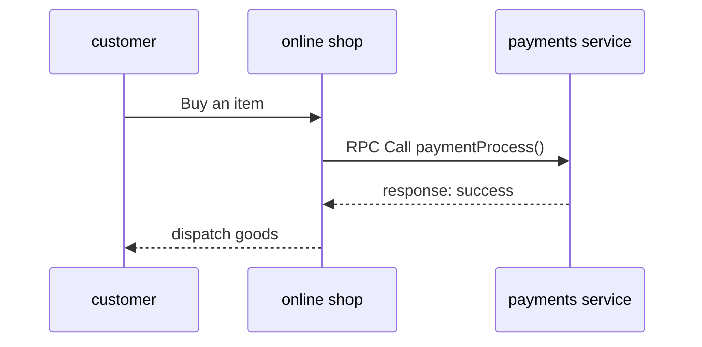

![[src/img/Pasted image 20231108154249.png]]
> [!info]
> The Two Generals' Problem was the first computer communication problem to be proved to be unsolvable.

Here we have two armies, each army is controlled by a general and their common goal is to attack the city, so the **General A** will send a messenger to **General B** to warn him that he is about to attack the city at 8AM.
Here a paradox emerges, if the city needs two armies to be defeated because of its strong defense, if the **General B** doesn't receive the message from **General A** supposing the messenger is dead or captured by the enemy, **General A** will attack alone and will be defeated.

Let's assume that **General A** needs confirmation from **General B** before attacking in order to secure the attack, this create a paradox because each of them will need a confirmation.
**General A** will need confirmation or risks attacking alone, so **General B** sends him confirmation but **General B** also needs confirmation because his messenger can be captured or killed and if so, then **General A** will not attack and **General B** again risks being defeated, and so on, this results in an infinite loop.

A real-life example of this problem can occur between a customer, an online shop and a payments service, assuming the payments service charged the customer's card when the online shop requested it, if the online shop doesn't receive a success response from the payments service because the packet is lost for some reason, the shop will not dispatch the item to the customer.

The parallel with the two generals problem happens between the shop and the payments services, the [[rpc]] call is the messenger and each of them needs the confirmation that the other has fulfilled its part of the contract.
The O_S needs a confirmation from the P_S to be sure that the client's credit card has been charged, otherwise the O_S will send the goods for free.
If the O_S doesn't dispatch the goods and the P_S charge the card, the customer is unhappy because he has been charged without receiving any goods.

The messages might get lost, so it's not possible for the online shop or the payments service to achieve the certainty that one action will happen if and only if the other action happens too.

**So why do online shops still work in real life?**  
It works because there are a bunch of second level safe guard that guarantee a reasonable outcome, for example if the card is charged but the shop doesn't have enough stock to fulfill the client's order, the shop will send an apology email to the client and issue a refund.

It's possible to solve this problem because the charge is a revocable action, so it's possible to get back to a safe state, but for the army, if one attacks without the other, the defeat cannot be <kbd><kbd>Ctrl</kbd> + Z</kbd>

Links:
- [[distributed system]]